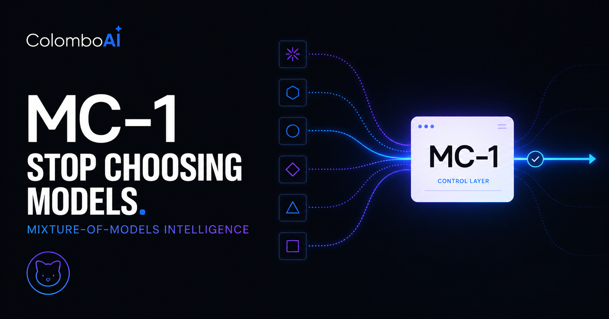
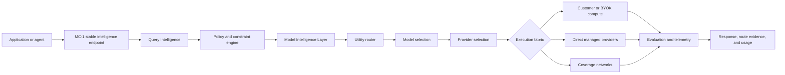

<p align="center">
  
</p>

<p align="center"><big><strong>ColomboAI-MC-1</strong></big></p>

<p align="center">
  <strong>Mixture-of-Models Intelligence for adaptive, cost-aware, policy-constrained AI inference.</strong>
</p>

<p align="center">
  One stable intelligence endpoint. A changing network of models, providers, and customer-controlled compute.
</p>

<p align="center">
  <a href="https://colomboai-mc1-intelligence.wilkont.chatgpt.site/"><strong>Open MC-1</strong></a>
  ·
  <a href="paper/ColomboAI-MC-1-Mixture-of-Models-Preprint.pdf"><strong>Read the paper</strong></a>
  ·
  <a href="mailto:sales@colomboai.com"><strong>Request an enterprise briefing</strong></a>
</p>

> [!IMPORTANT]
> This is the public information and research repository for MC-1. It intentionally contains **no MC-1 application source code, provider credentials, deployment configuration, routing weights, customer data, or production secrets**.

---

## What is MC-1?

MC-1 is ColomboAI's **Mixture-of-Models (MOM) intelligence control plane**. Instead of permanently binding an application to one model or one inference vendor, MC-1 turns model and provider selection into a policy-aware runtime decision.

An application submits a task to the stable `colomboai/mc-1` intelligence profile. MC-1 can then:

1. understand the request and its execution requirements;
2. enforce privacy, region, provider, budget, latency, and capability constraints;
3. compare eligible model and provider routes;
4. select an execution path according to the requested objective;
5. execute with bounded retry and failover behavior;
6. evaluate the returned result and escalate when policy permits;
7. record route, usage, cost, and accounting evidence for the tenant.

MC-1 does **not** claim that one model is universally best. Its core premise is that the best available intelligence is contextual: a function of the task, modality, operating policy, economics, latency target, privacy boundary, and current provider health.

## The idea in one diagram



The architecture separates two questions that are often conflated:

- **Which intelligence should answer?** Model capability, task fit, context, modality, tools, quality, and risk.
- **Where should it run?** Provider health, price, latency, privacy, geography, capacity, contractual policy, and availability.

## Why Mixture-of-Models?

Mixture-of-Experts systems conditionally activate subnetworks *inside* one trained model. MC-1 moves conditional computation one level higher: its experts are complete, independently trained models that may use different architectures, tokenizers, providers, regions, hardware, licenses, and operating policies.

That creates three practical opportunities:

- **Specialization:** small, local, multimodal, reasoning, coding, and long-context models can each serve the workload regions where they are strongest.
- **Economics:** easy or latency-sensitive work need not consume the most expensive available model.
- **Sovereignty:** the logical intelligence endpoint can span local, private, customer-owned, and approved external compute without treating governance as an afterthought.

The research challenge is not merely whether a diverse pool contains complementary models. It is whether a realizable router can identify that complementarity *before* seeing the answer. The MC-1 paper therefore distinguishes the best fixed model, an outcome oracle, and the performance actually recovered by a deployable router.

## How MC-1 works

### 1. Query Intelligence

MC-1 derives lightweight pre-answer signals such as domain, estimated difficulty, reasoning depth, context size, modality, tool use, language, structured-output requirements, privacy sensitivity, risk, and expected value.

### 2. Policy-first eligibility

Hard constraints are applied before optimization. A cheaper or nominally stronger route cannot compensate for violating a local-only rule, provider allowlist, regional restriction, maximum cost, required capability, or data-classification policy.

### 3. Model Intelligence Layer

MC-1 represents models as multidimensional capability and operating profiles rather than one leaderboard number. A model profile can include:

- reasoning, math, coding, vision, multilingual, tool-use, and structured-output capability;
- context capacity and modality support;
- input, output, and fixed-request price information;
- latency, throughput, availability, and failure evidence;
- provider, region, hardware, quantization, and policy labels;
- provenance, uncertainty, recency, and sample counts.

### 4. Constrained utility routing

After removing infeasible candidates, MC-1 ranks executable routes using the deployment objective. Objectives can prioritize balanced utility, quality, cost, latency, privacy, sovereignty, or local execution. Provider ordering and pinning remain available when an operator needs deterministic control.

### 5. Confidence-aware execution

MC-1 can attempt a cost-efficient route first, evaluate whether the result satisfies the request contract, and escalate when confidence is insufficient and policy allows. Fallbacks preserve hard constraints; a local-only request must not silently escape to external compute.

### 6. Evidence and closed-loop learning

Each route can produce evidence about classification, eligibility, selection, provider attempts, latency, usage, price provenance, evaluation, fallback behavior, and policy decisions. That evidence is the basis for auditability and future capability updates.

## Three routing modes

| Mode | What the caller specifies | What MC-1 decides | Typical use |
|---|---|---|---|
| **Smart** | `colomboai/mc-1` plus the task and constraints | Model, provider, and bounded execution strategy | Default adaptive intelligence |
| **Manual model** | A verified canonical model | Eligible provider and failover path | Model-specific evaluation or compatibility |
| **Manual model + provider** | A verified model plus provider pin/order rules | Execution within the caller's allowed set | Regulated, contractual, or deterministic operations |

Manual control does not mean arbitrary execution. Model identifiers still require a verified mapping and routes remain subject to capability, price, policy, and availability checks.

## Execution fabric

MC-1 is a control plane; it does not present itself as the owner of every accelerator that executes a request.

| Execution class | Purpose | Billing and governance boundary |
|---|---|---|
| **Customer / BYOK compute** | Customer-supplied OpenAI-compatible endpoint or private deployment | Provider compute remains on the customer account; MC-1 does not create a ColomboAI provider payable |
| **Direct managed provider** | Direct adapters to approved inference providers | MC-1 requires normalized pricing and records provider attempts and payable evidence |
| **Coverage network** | Broad model/provider reach and resilience | Used only when price, policy, capability, and health requirements are satisfied |

The deployed adapter architecture includes OpenRouter, Together AI, Fireworks AI, Nebius Token Factory, NVIDIA NIM, vLLM/custom OpenAI-compatible endpoints, and request-scoped customer compute. Availability of a particular model or modality depends on current production configuration and verified mappings.

## MC-1 compared with adjacent platforms

These products solve different layers of the inference stack. The table is intended to clarify category boundaries, not declare one universal winner.

| Product | Primary role | Cross-provider abstraction | Request-level model intelligence | Local / self-hosted path | Policy-aware route constraints | Financial control-plane scope |
|---|---|---:|---:|---:|---:|---:|
| **Cairo.sh / MC-1** | Provider-independent Mixture-of-Models control plane | **Yes** | **Core product concept**: task, capability, objective, confidence, and policy signals | **Yes**, through customer/private OpenAI-compatible compute | **Core product concept** | Credits, reservations, usage ledger, provider attempts/payables, and settlement evidence |
| **OpenRouter** | Hosted unified API and routing layer across many models/providers | **Yes** | Offers routers including automatic model selection; also provides strong provider-routing controls | Not a local model runtime; custom/provider routes depend on its supported network and integrations | Provider preferences, fallbacks, parameter requirements, and data-policy controls | Centralized usage/credit accounting for OpenRouter traffic |
| **Ollama** | Local model packaging and runtime | No hosted multi-provider network | Model choice is generally caller/operator driven | **Core product concept** | Primarily local runtime controls rather than a cross-provider enterprise policy plane | No managed provider-payable settlement plane |
| **Nebius Token Factory** | Managed AI inference platform/provider | Models are served within the Nebius platform | Caller selects among available endpoints/models; not positioned as a provider-neutral MOM control plane | Dedicated and managed deployment options; not a desktop local runtime | Provider/platform deployment controls | Provider-native consumption and billing |
| **Together AI** | Managed AI acceleration and inference provider | Broad model catalog within Together's platform | Supports serverless/dedicated model execution; caller typically selects the model | Dedicated endpoints, not a general local desktop runtime | Provider/platform controls | Provider-native usage and billing |
| **Fireworks AI** | Managed generative-AI inference platform/provider | Broad model catalog within Fireworks' platform | Supports serverless, on-demand, and dedicated deployments; caller typically selects the model | Dedicated deployments, not a general local desktop runtime | Provider/platform controls | Provider-native usage and billing |
| **vLLM** | Open-source high-throughput inference engine | No hosted provider marketplace in the engine itself | The engine serves selected models; the separate vLLM Semantic Router project adds signal-driven routing | **Core product concept** | Deployment-defined; semantic routing is a separate layer | No built-in commercial provider settlement network |

### The key distinction from OpenRouter

OpenRouter is a valuable coverage network and unified API. It can route among providers for a selected model and offers router models that choose among models. MC-1 is designed as an **enterprise intelligence control plane above and across execution networks**. Its architecture explicitly separates model intelligence from provider intelligence and treats customer compute, direct providers, coverage networks, hard policy constraints, route evaluation, credit reservation, and provider settlement evidence as parts of one control loop.

MC-1 can therefore use OpenRouter as one eligible execution network without reducing MC-1 itself to an OpenRouter wrapper.

### The key distinction from Ollama and vLLM

Ollama and vLLM make models executable on operator-controlled infrastructure. MC-1 decides **which eligible intelligence path should execute a request** and can include an Ollama/vLLM-style OpenAI-compatible endpoint as customer or private compute. Runtime engines and the MC-1 control plane are complementary layers.

### The key distinction from Nebius, Together, and Fireworks

Nebius, Together, and Fireworks operate inference platforms. MC-1 is provider-independent: it can evaluate direct-provider routes alongside customer compute and coverage networks, while applying one caller-facing policy and evidence model.

## Control, privacy, and sovereignty

MC-1 treats governance as an eligibility decision, not merely a score adjustment. Representative controls include:

- provider and model allowlists;
- explicit provider order or pinning;
- approved regions and sovereignty objectives;
- standard, zero-data-retention, private, or sovereign privacy requirements;
- public, internal, confidential, and restricted data classifications;
- maximum request cost and latency constraints;
- required tool, structured-output, streaming, vision, or modality support;
- fail-closed behavior when no route satisfies policy.

Sovereignty is a property of the entire route—not just the model name. The endpoint, provider, region, credentials, logging behavior, fallback chain, and data policy must all remain inside the approved boundary.

## Economic and operational controls

The MC-1 production architecture separates customer pricing, provider cost, and platform economics. Its control surfaces include:

- pre-inference credit reservation for managed routes;
- rejection before provider spend when prepaid credit is insufficient;
- authoritative per-model price configuration or provider price snapshots;
- route- and attempt-level usage evidence;
- separate customer price, provider payable, platform fee, and margin fields;
- append-oriented financial journal entries;
- provider settlement periods, variance review, and reconciliation evidence;
- BYOK isolation so customer-funded compute does not become a ColomboAI provider liability.

Financial controls reduce operational risk; they do not turn estimated or unreconciled values into audited financial statements. Provider reports and invoices remain authoritative inputs to settlement review.

## Supported API shapes

MC-1 presents provider-independent interfaces modeled around common OpenAI-compatible surfaces:

- chat completions;
- responses;
- model and provider discovery;
- route, activity, usage, and billing views;
- image, audio, video, and embeddings routes when production adapters and prices are enabled.

The public repository documents the interface at a product level. It does not publish production credentials, private endpoint details, internal routing weights, or server implementation code.

## Example request concepts

Smart routing uses the stable intelligence profile:

```json
{
  "model": "colomboai/mc-1",
  "messages": [
    {"role": "user", "content": "Design a fault-tolerant payment service and explain the tradeoffs."}
  ],
  "mc1": {
    "objective": "balanced",
    "max_cost_usd": 0.25,
    "privacy": "standard"
  }
}
```

Advanced callers can request a verified model and constrain provider execution:

```json
{
  "model": "verified/model-id",
  "provider": {
    "order": ["customer-compute", "approved-direct-provider"],
    "allow_fallbacks": true
  },
  "messages": [
    {"role": "user", "content": "Analyze this workload under the approved provider policy."}
  ]
}
```

These examples describe the contract; they are not production credentials or guarantees that every illustrative identifier is currently enabled.

## Where MC-1 fits

MC-1 is intended for teams that need more than a static model alias:

- AI products that want one stable intelligence abstraction while the model pool evolves;
- enterprises balancing quality, cost, latency, privacy, region, and provider commitments;
- agent systems that need different models for planning, coding, vision, tools, and verification;
- sovereign or hybrid deployments spanning private and approved public compute;
- platform teams that need route evidence, bounded failover, and provider cost accountability;
- model providers that want their specialized models to compete on measurable task fit rather than global popularity alone.

## Research paper

**ColomboAI-MC-1: A Mixture-of-Models Intelligence System for Adaptive, Cost-Efficient, and Sovereign AI Inference**  
Wilfried Kouadio and Andrew Li, ColomboAI / Cairo Lab. Preprint, August 14, 2026.

[Download the complete PDF](paper/ColomboAI-MC-1-Mixture-of-Models-Preprint.pdf)

The paper presents:

- the distinction between Mixture-of-Experts and Mixture-of-Models;
- Query Intelligence, Model Intelligence, constrained utility routing, cascading, deliberation, and self-evaluation;
- a formal best-fixed-model, outcome-oracle, and realizable-router framework;
- oracle recovery as a measure of captured model complementarity;
- an evaluation protocol spanning quality, cost per correct answer, latency, calibration, regret, availability, and policy compliance;
- sovereign, local-first, hybrid, and latency-critical policy patterns;
- an explicit claim boundary and reproducibility agenda.

> [!NOTE]
> The preprint is an architecture and methods paper. Its conceptual Pareto diagram is illustrative, and the authors intentionally do not present unpublished MC-1 benchmark numbers as measured results. A future empirical release should disclose exact models, versions, prompts, inference settings, routing traces, price tables, held-out results, and evaluation code.

## Product access

- **MC-1 platform:** [Launch Cairo.sh / MC-1](https://colomboai-mc1-intelligence.wilkont.chatgpt.site/)
- **Cairo:** [cairo.sh](https://cairo.sh/)
- **ColomboAI:** [colomboai.com](https://colomboai.com/)
- **Enterprise and provider inquiries:** [sales@colomboai.com](mailto:sales@colomboai.com)

## Current public status

- The MC-1 control plane is deployed.
- Production health reports the database ready and inference providers configured.
- Canonical MC-1 profiles include efficient, reasoning, and multimodal operating profiles.
- Profile values labeled as operator configuration are not represented as measured benchmark results.
- Specific providers, models, modalities, prices, and regions can change as mappings are verified and operating conditions evolve.
- A successful readiness check confirms configuration, not universal model availability or completion of every enterprise certification.

## Frequently asked questions

### Is MC-1 a model?

MC-1 is an intelligence control plane and stable logical model profile, not one fixed set of model weights.

### Does MC-1 train or own every underlying model?

No. It can route to independently developed models running on customer, direct-provider, or coverage-network compute.

### Is MC-1 just a cheapest-model router?

No. Cost is one objective among capability, quality, latency, privacy, policy, health, availability, confidence, and operator preferences.

### Does MC-1 replace inference engines such as Ollama or vLLM?

No. Those engines can be execution substrates. MC-1 operates at the intelligence-selection and control-plane layer.

### Does MC-1 replace OpenRouter?

Not necessarily. OpenRouter can be an eligible coverage network inside MC-1. MC-1 additionally coordinates customer compute, direct providers, model intelligence, policy, evaluation, accounting, and settlement evidence.

### Can customers bring their own provider?

The architecture supports customer-controlled OpenAI-compatible endpoints. BYOK compute remains financially separated from ColomboAI-managed provider payables.

### Is the MC-1 source code in this repository?

No. This repository intentionally publishes product information, research, diagrams, and access links only.

## Official comparison sources

Product capabilities evolve. The comparison above was prepared from first-party material and should be revalidated for procurement or architecture decisions:

- [OpenRouter documentation](https://openrouter.ai/docs/quickstart) and [provider routing](https://openrouter.ai/docs/guides/routing/provider-selection)
- [Ollama documentation](https://docs.ollama.com/)
- [Nebius Token Factory documentation](https://docs.tokenfactory.nebius.com/)
- [Together AI documentation](https://docs.together.ai/docs/introduction)
- [Fireworks AI documentation](https://docs.fireworks.ai/getting-started/introduction)
- [vLLM documentation](https://docs.vllm.ai/) and [vLLM Semantic Router](https://github.com/vllm-project/semantic-router)

“Not documented” should not be read as proof that a private-preview, partner, or newly released capability does not exist. This repository makes no cross-product quality, latency, uptime, reliability, or price-superiority claim without a common reproducible benchmark.

## Repository policy

This public repository accepts documentation and research corrections. It is not the MC-1 production source repository and should never receive:

- application or infrastructure source code;
- provider, Stripe, alerting, identity, or registry credentials;
- customer prompts, responses, traces, or account data;
- private pricing, routing weights, contracts, or incident material;
- deployment archives, environment files, or database exports.

For security-sensitive reports, do not open a public issue. Contact [sales@colomboai.com](mailto:sales@colomboai.com) and request the appropriate security channel.

---

<p align="center">
  
</p>

<p align="center">
  <strong>Built by ColomboAI · Cairo Lab</strong><br>
  Intelligence should be selected at runtime, governed by policy, and measured by outcomes.
</p>

<p align="center"><sub>© 2026 ColomboAI. All rights reserved. Product names and trademarks belong to their respective owners.</sub></p>
